# MpeiApp — самое функциональное и часто обновляемое бесплатное приложение для студентов МЭИ

  
  
  
  
  
  
  

## Ключевые особенности

- Доступно для [Android](https://play.google.com/store/apps/details?id=com.mpeiapp) и [iOS](https://apps.apple.com/ru/app/mpeiapp/id1618910681).
- Значимые разделы БАРС МЭИ: оценки, пропуски, зачётная книжка, стипендии, задания, анкеты и другое.
- QR-сканер с авторегистрацией присутствия на занятиях и любых мероприятиях МЭИ — везде, где вуз использует свои QR-коды регистрации.
- Интерактивная 3D-карта с важными местами МЭИ и окрестностей, фильтрами по категориям и маршрутами к ним или к пользовательским точкам. Используется [интеграция Яндекс Карт](https://github.com/volga-volga/react-native-yamap).
- Автоматический подсчёт и систематизация пропусков.
- Счётчики важных вещей, включая непрочитанные письма в ОСЭП и активные стипендии.
- Расписание своей и любой другой группы, преподавателя или аудитории.
- Интерактивный виджет для быстрого просмотра расписания без запуска приложения.
- Анализ дисциплин после закрытия БАРС.
- Офлайн-режим и настройки внешнего вида приложения.

## Скриншоты

Экран второго фактора | Страница оценок | Выбор раздела БАРС | Пропуски занятий
--- | --- | --- | ---
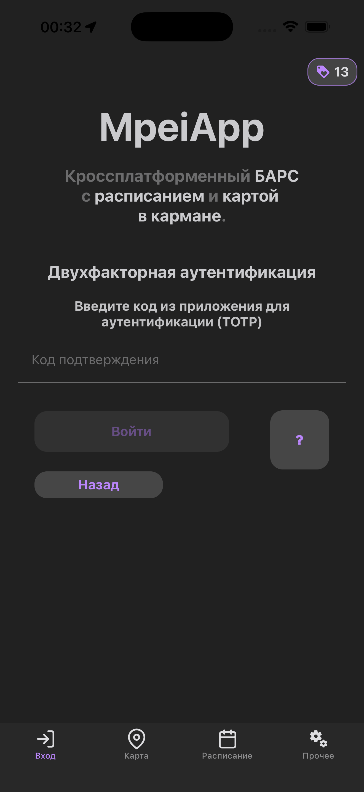 | 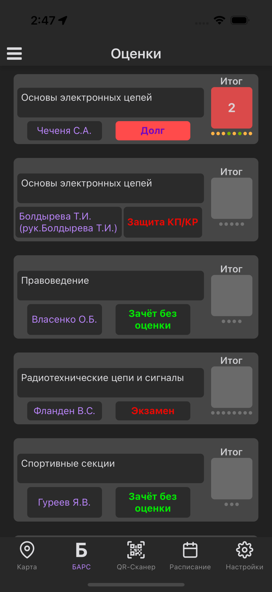 | 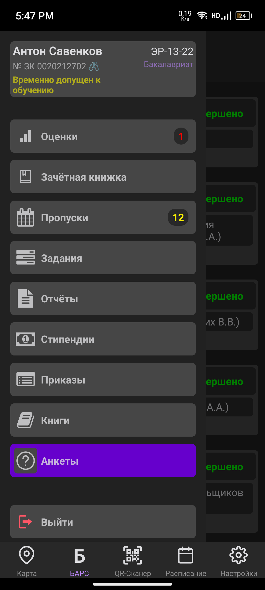 | 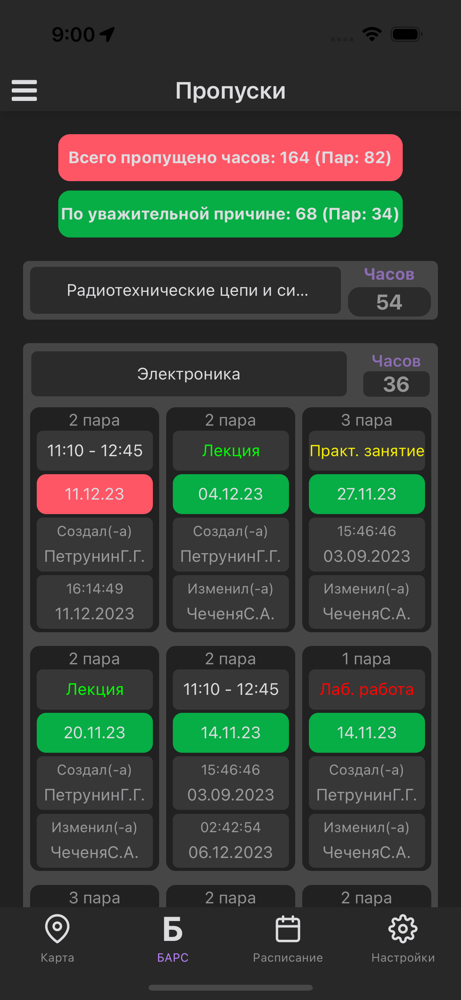

Карта — общий вид | Выбор маршрута | Категории на карте | Зачётная книжка
--- | --- | --- | ---
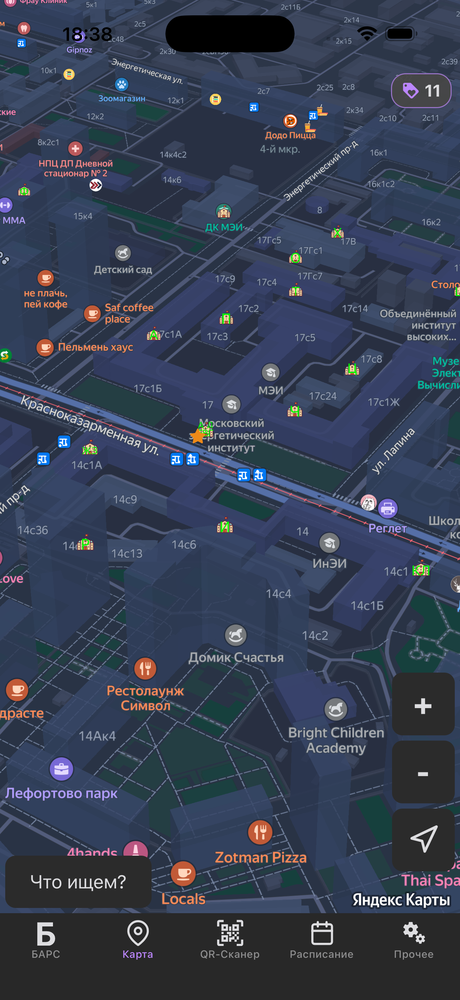 | 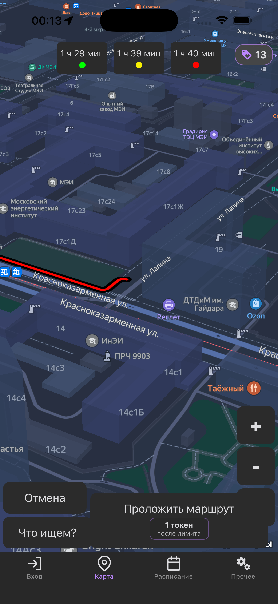 | 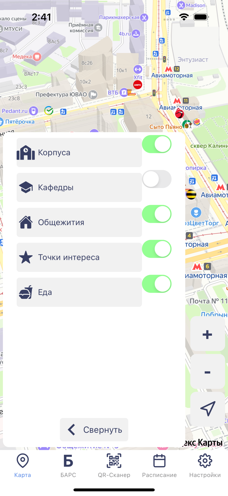 | 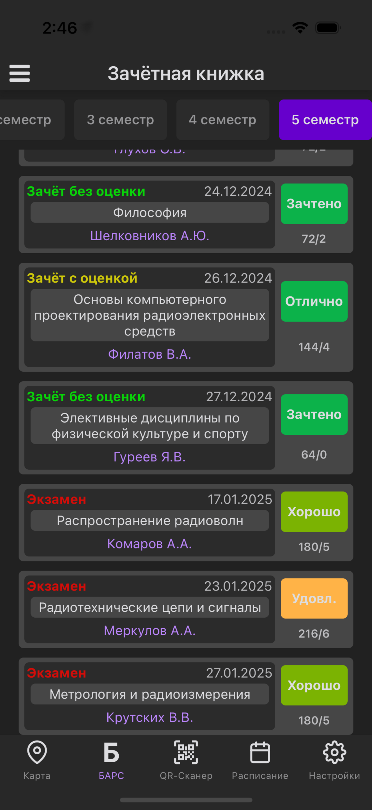

Расписание | Расписание аудитории | QR-сканер: авторегистрация | Стипендии
--- | --- | --- | ---
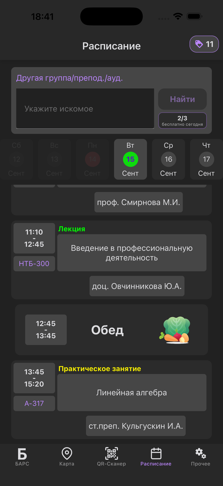 | 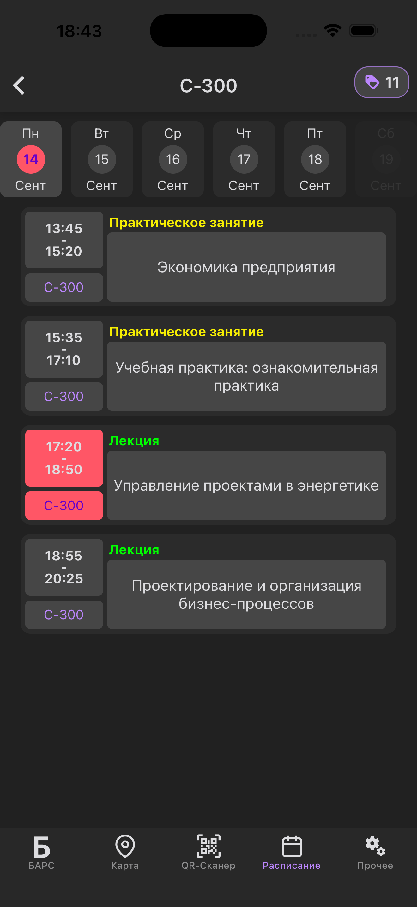 | 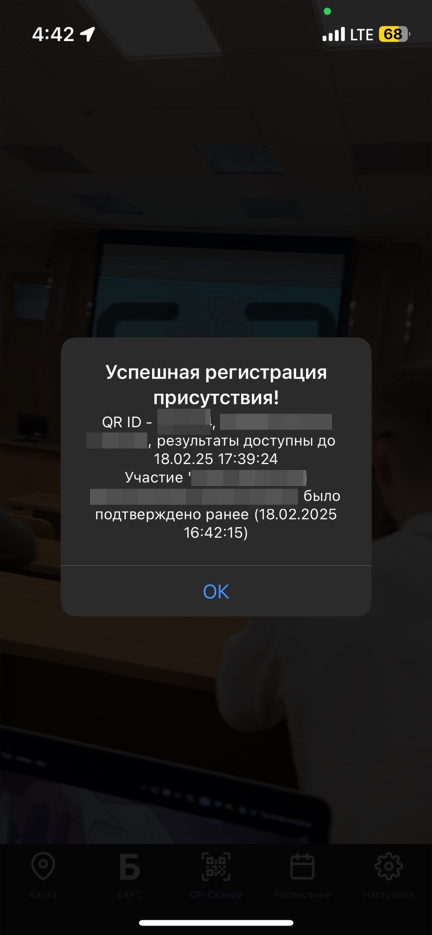 | 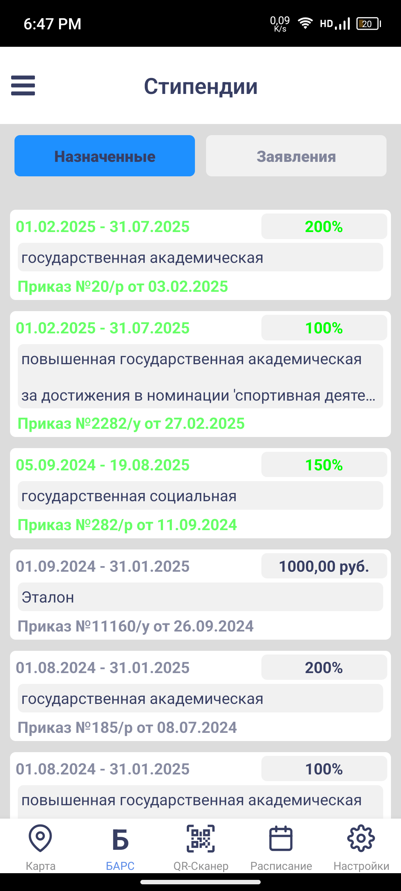

## Реклама и DragoNet

MpeiApp остаётся бесплатным. Реклама и интеграция с DragoNet помогают покрывать расходы на разработку и инфраструктуру, чтобы приложение можно было и дальше поддерживать, выпуская обновления и сохраняя доступным в магазинах. Активная подписка DragoNet отключает рекламу в приложении и открывает связанные с ней преимущества.

## Стек и архитектура

Клиент написан на TypeScript с React Native для Android и iOS. Навигация построена на React Navigation, состояние экранов и данных БАРС хранится в Redux Toolkit, а локальные данные и настройки — в MMKV. Нативные возможности включают Яндекс Карты, камеру и QR-сканер, геолокацию и виджет расписания.

Слой API разбирает ответы БАРС отдельными парсерами и поддерживает авторизацию, включая второй фактор. Для DragoNet приложение обращается к выделенному `vpn-subscription-proxy`: мобильный клиент получает только публичную конфигурацию и результат проверки или демо-доступа, а proxy изолирует учётные данные панели подписок и выполняет ограниченные запросы к ней.

В репозитории есть Jest-тесты для интерфейса, парсеров, авторизации, рекламы и DragoNet. GitHub Actions запускает проверку качества мобильного кода, Metro smoke, сборку debug APK и отдельную проверку качества proxy.

## Disclaimer

**MpeiApp — неофициальное приложение; официальных приложений МЭИ не существует.**

Разработчик ранее обучался в МЭИ, но сейчас никак с вузом не связан. Поэтому он может, но не обязан отвечать на вопросы о МЭИ, которые не относятся к приложению.

Мы не можем гарантировать бесперебойную работу или абсолютную безопасность приложения и не несём ответственности за проблемы, связанные с его использованием. Приложение предоставляется **as is**.

## Обратная связь

Если вы столкнулись с проблемой при использовании MpeiApp, хотите предложить улучшение или помочь проекту:

- [Сообщество ВКонтакте](https://vk.com/mpeiapp)
- [Личный Telegram разработчика (DragonSavA)](https://t.me/DragonSavA)
